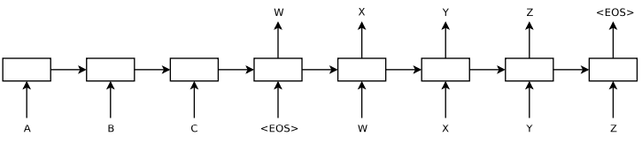

# Seq2Seq

> Sequence to Sequence Learning with Neural Networks 
> arxiv : <https://arxiv.org/pdf/1409.3215.pdf>



## Setup
There is two options. (docker / pip)

### Docker
```bash
$ docker-compose up -d
$ docker exec -ti <container_name> bash
```
### pip
```bash
$ pip install -r requirements.txt
```

## Usage
### Train
```
usage: main.py [-h] [--name NAME] [--ck_path CK_PATH] [--epochs EPOCHS] [--batch_size BATCH_SIZE] [--path PATH] [--vocab_path VOCAB_PATH] [--beam_size BEAM_SIZE]

Seq2Seq

optional arguments:
  -h, --help            show this help message and exit
  --name NAME
  --ck_path CK_PATH
  --epochs EPOCHS
  --batch_size BATCH_SIZE
  --path PATH
  --vocab_path VOCAB_PATH
  --beam_size BEAM_SIZE
```
### Inference
```
usage: translate.py [-h] [--name NAME] [--ck_path CK_PATH] [--path PATH] [--vocab_path VOCAB_PATH] [--beam_size BEAM_SIZE]

Seq2Seq

optional arguments:
  -h, --help            show this help message and exit
  --name NAME
  --ck_path CK_PATH
  --path PATH
  --vocab_path VOCAB_PATH
  --beam_size BEAM_SIZE
```
Example
```json
```

## Result