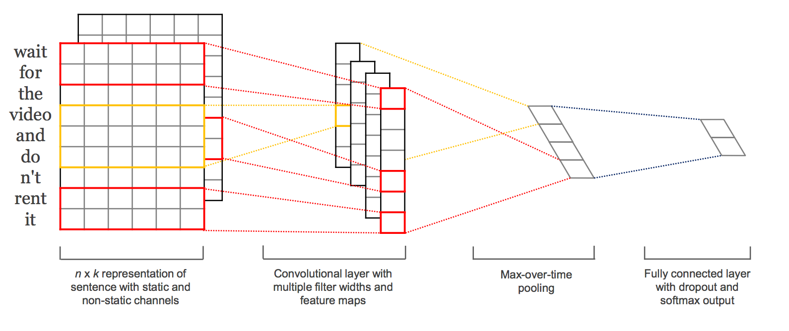

# TextCNN

> Convolutional Neural Networks for Sentence Classification  
> arxiv : <https://arxiv.org/pdf/1408.5882.pdf>



## Setup
There is two options. (docker / pip)

### Docker
```bash
$ docker-compose up -d
$ docker exec -ti <container_name> bash
```
### pip
```bash
$ pip install -r requirements.txt
```

## Usage
### Train
```
usage: main.py [-h] [--name NAME]
               [--mode {rand,static,non-static,multichannel}] [-e EPOCHS]
               [-b BATCH_SIZE] [--embedding_dim EMBEDDING_DIM]
               [--n_filters N_FILTERS] [--filter_sizes FILTER_SIZES]
               [--output_dim OUTPUT_DIM] [--dropout DROPOUT]
               [--l2_constraint L2_CONSTRAINT] [--cv] [--cv_num CV_NUM]
               [--path PATH] [--ck_path CK_PATH]

TextCNN

optional arguments:
  -h, --help            show this help message and exit
  --name NAME           name of checkpoint file
  --mode {rand,static,non-static,multichannel}
  -e EPOCHS, --epochs EPOCHS
  -b BATCH_SIZE, --batch_size BATCH_SIZE
                        batch size
  --embedding_dim EMBEDDING_DIM
                        dimension of word vectors
  --n_filters N_FILTERS
                        number of feature maps
  --filter_sizes FILTER_SIZES
                        filter window size
  --output_dim OUTPUT_DIM
                        dimension of output
  --dropout DROPOUT     dropout rate of final layer
  --l2_constraint L2_CONSTRAINT
                        reference value of weight vectors to rescale
  --cv                  cross validation
  --cv_num CV_NUM       number of datasets divided if --cv option is given
  --path PATH           data path
  --ck_path CK_PATH     checkpoint path
```
### Inference
```
usage: chat.py [-h] [--name NAME]
               [--mode {rand,static,non-static,multichannel}]
               [--embedding_dim EMBEDDING_DIM] [--n_filters N_FILTERS]
               [--filter_sizes FILTER_SIZES] [--dropout DROPOUT]
               [--l2_constraint L2_CONSTRAINT] [--ck_path CK_PATH]

TextCNN

optional arguments:
  -h, --help            show this help message and exit
  --name NAME           name of checkpoint file
  --mode {rand,static,non-static,multichannel}
  --embedding_dim EMBEDDING_DIM
                        dimension of word vectors
  --n_filters N_FILTERS
                        number of feature maps
  --filter_sizes FILTER_SIZES
                        filter window size
  --dropout DROPOUT     dropout rate of final layer
  --l2_constraint L2_CONSTRAINT
                        reference value of weight vectors to rescale
  --ck_path CK_PATH     checkpoint path
```
Example
```json
>>> this film is so great
0.67
>>> this film is so bad
0.00
>>> this film is so terrible
0.01
>>> this film is fantastic
1.00
>>> i don't know this film is good
0.01
```

## Result

